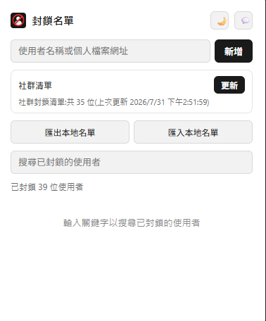
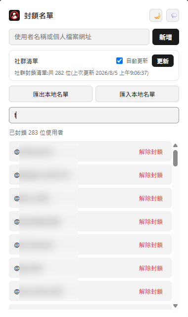
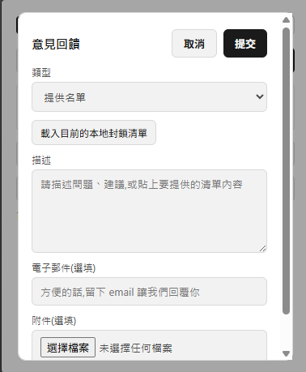

# Threads Cleaner(脆脆清道夫)


一個 Chrome 擴充功能,讓你可以封鎖特定 Threads 使用者,封鎖後的貼文不會出現在動態消息、單篇貼文頁面或搜尋結果裡。

> [!IMPORTANT]
> **本地端作用說明**
> 因 Threads 官方未提供開放的封鎖 API，本擴充功能的封鎖效力**僅作用於當前電腦的瀏覽器**，無法同步至手機端 App。
> 如果未來官方開放，將會補上後端封鎖的功能

---

## 📸 功能截圖

### 1. 一鍵封鎖惱人廣告


### 2. 更新社群封鎖清單



### 3. 個別封鎖解除



### 4. 名單回報



### 5. 外觀與自動更新設定


## ✨ 核心特色

- **就地封鎖**:貼文的使用者名稱旁直接出現 🚫 按鈕,點擊後會先跳出確認提示,確認後才會生效,避免手滑誤觸
- **支援三大核心頁面**:涵蓋首頁動態消息、單篇貼文頁(含底下熱門回覆)以及搜尋結果
- **本地封鎖清單管理**:在 popup 裡新增、搜尋、解除封鎖,不需要離開分頁
- **匯出 / 匯入**:本地清單可以匯出成純文字檔備份或分享,也可以匯入合併,匯入時會自動略過重複與格式錯誤的內容
- **訂閱社群清單**:一鍵從遠端網址下載共用的封鎖名單並套用,更新時只抓有變化的內容,並顯示這次新增/移除了幾筆
- **社群清單自動更新(選用)**:popup 裡打勾就能開啟,背景 service worker 每天自動檢查一次有沒有新版本,不用特地打開 popup 才會更新——**預設關閉**,完全由你自己決定要不要開,不會偷偷幫你打開
- **保留使用者的最終決定權**:即使某個使用者是社群清單封鎖的,也可以在 popup 個別解除封鎖,之後社群清單再更新也不會把他加回來
- **即時同步**:不論是在頁面上點封鎖按鈕、或是在 popup 新增/刪除/更新社群清單,所有已開啟的 Threads 分頁都會立刻反映最新狀態,不需要重新整理頁面
- **問題回報 / 意見回饋 / 提供名單**:點擊 popup 右上角的 💬 按鈕即可開啟表單。選擇「提供名單」時可以一鍵載入目前的本地封鎖清單到描述欄,送出前使用者一定能親眼確認實際內容;送出前也會做基本檢查——問題回報與意見回饋一定要填描述,提供名單則只要描述或附件擇一即可
- **淺色 / 深色主題**:popup 右上角一鍵切換,選擇會記住;沒設定過的話跟隨系統的深色/淺色模式
- **多語系介面**:支援繁體中文、English、日本語、Español、Português,自動偵測瀏覽器介面語言顯示對應版本,找不到對應語言就用英文,沒有語言切換按鈕(照瀏覽器設定走)

## 🛠 技術棧

- **[TypeScript](https://www.typescriptlang.org/)**(strict mode)— 全專案型別檢查,不使用 `any`
- **[Vite](https://vite.dev/)** + **[@crxjs/vite-plugin](https://crxjs.dev/vite-plugin)** — Chrome Extension Manifest V3 的打包與開發環境
- **Chrome Extension APIs** — `chrome.storage.local`(資料儲存與跨頁面同步)、`chrome.storage.onChanged`、`chrome.alarms`(背景定時喚醒,用於社群清單自動更新)、`chrome.i18n`(偵測瀏覽器介面語言、在地化擴充功能名稱與描述)
- **MV3 Background Service Worker** — 定期喚醒檢查社群清單是否該自動更新,即使 popup 完全沒被打開也能運作
- **原生 DOM API** — `MutationObserver` 監看頁面變化,不依賴任何前端框架(無 React / Vue),純 vanilla TypeScript class
- **Web Crypto API** — `crypto.subtle.digest` 計算社群清單內容雜湊,用來判斷是否需要更新
- **Cloudflare Workers + Mailgun** — 意見回饋表單的後端,獨立部署、不包含在擴充功能本身的打包內容裡,原始碼在 `src/cloudflare-worker/`
- **vite-plugin-zip-pack** — 建置完成後自動打包成可上傳 Chrome 線上應用程式商店的 zip

## 🚀 開發與建置說明

### 前置需求

- [Node.js](https://nodejs.org/) 18 以上版本
- npm(或相容的套件管理工具,例如 bun)

### 安裝依賴

```bash
npm install
```

### 開發模式

```bash
npm run dev
```

接著在 Chrome 開啟 `chrome://extensions`,開啟右上角的「開發人員模式」,點選「載入未封裝項目」,選擇專案底下由 Vite 產生的 `dist` 資料夾。修改程式碼後,Vite 會自動重新建置,擴充功能也會跟著熱更新。

> 這個專案有一個背景 service worker(`src/background/`),載入之後建議到 `chrome://extensions` 找到這個擴充功能,點「service worker」那個連結打開它的 DevTools,確認有正常啟動、沒有噴錯。

### 正式建置

```bash
npm run build
```

會先跑 `tsc` 做型別檢查,通過後用 Vite 打包到 `dist/`,並自動產生一份可直接上傳的 zip 到 `release/` 資料夾。

### 意見回饋後端(Cloudflare Worker)

`src/cloudflare-worker/worker.js` 是獨立的部署單位,**不會**被 Vite 打包進擴充功能本身,需要另外手動部署:

1. 到 Cloudflare Dashboard 建立一個 Worker,把 `worker.js` 的內容貼進去、部署
2. 在 Worker 的 Settings → Variables and Secrets 新增:
   - `MAILGUN_API_KEY`(Secret)
   - `MAILGUN_DOMAIN`(純文字,你的 Mailgun 網域)
   - `NOTIFY_EMAIL`(純文字,實際收信的信箱)
3. 把 Worker 網址填進 `manifest.config.ts` 的 `host_permissions`,以及 popup 意見回饋功能實際呼叫的網址

詳細步驟寫在 `worker.js` 檔案開頭的註解裡。

### 專案結構

```
src/
  background/         背景 service worker,用 chrome.alarms 定期喚醒,檢查社群清單是否該自動更新
  content/            進到 Threads 頁面時執行的 content script 進入點
  core/               跟畫面無關的純邏輯:封鎖名單管理、清單格式解析、共用工具函式
  dom/                只有 content script 會用到、專門處理 Threads 頁面 DOM 的部分
  i18n/               多語系字典與翻譯查詢工具,content script / popup / background 共用
  storage/            chrome.storage.local 的存取層
  popup/              點擊擴充功能圖示後顯示的 popup 畫面
  cloudflare-worker/  意見回饋功能用的 Cloudflare Worker 原始碼(獨立部署,見上一節)

public/
  _locales/           Chrome 原生 i18n,只影響 chrome://extensions 頁面顯示的擴充功能名稱/描述
```

`core/`、`storage/`、`i18n/` 不依賴瀏覽器 DOM,由 content script、popup、background 共用;`dom/` 只被 content script 使用。

## 🔒 隱私與安全性

- **資料只留在本機**:封鎖清單(手動新增的、訂閱的社群清單)、主題與語言偏好、自動更新設定,全部存在 `chrome.storage.local`,只存在你自己的瀏覽器裡,沒有任何後端伺服器,開發者也拿不到你的封鎖名單內容
- **對外連線只有這幾種情境**:
  - 按下「更新」社群清單、或是開啟自動更新後由背景 service worker 每天檢查一次時,對外發出一個 GET 請求下載清單內容,不會回傳任何資料給對方,也不會夾帶任何識別身分的資訊
  - 在意見回饋表單按下「提交」時,會把表單內容(類型、描述、選填的 email、選填的附件)送到專用的 Cloudflare Worker 轉寄成 email,僅用於回報問題或提供名單,不會有任何自動或背景送出的行為
- **社群清單自動更新預設關閉**:要在 popup 裡自己打勾才會啟用,啟用後背景執行的動作跟手動按「更新」完全一樣(只是下載一份清單檔案),不會多蒐集任何東西
- **不收集任何個人資料**:不會讀取、蒐集、回傳你的 Threads 帳號資訊、瀏覽紀錄或任何個人資料
- **最小權限原則**:
  - `storage`:讀寫本機的封鎖清單與偏好設定
  - `alarms`:定期喚醒背景 service worker,判斷是否該自動更新社群清單(使用者需要自己啟用,預設關閉)
  - `host_permissions`:
    - `cdn.jsdelivr.net`:只用來下載社群清單這個純文字檔案
    - `hsinte-mail.qazx0931.workers.dev`:只用來轉送使用者主動送出的意見回饋表單
  - content script 只會在 `https://www.threads.com/*` 上執行,不會讀取或影響其他網站
- **開源透明**:程式碼公開,任何人都可以檢視實際的行為是否符合以上說明

## 📄 授權條款 (License)

本專案採用 **[MIT License](https://rem.mit-license.org)** 授權條款。

您可以自由地複製、修改、分發此軟體，甚至用於商業用途，唯獨需在所有副本中包含原始的版權聲明與許可聲明。軟體依「現狀」提供，不承擔任何擔保責任。
